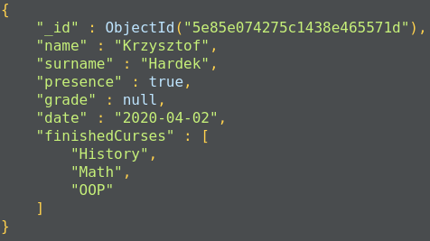
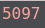
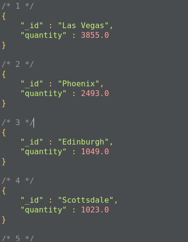
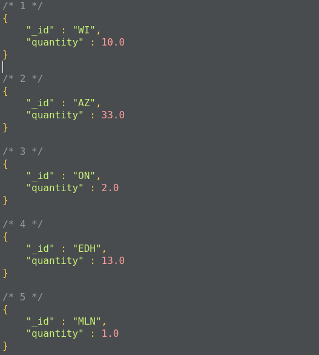
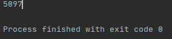
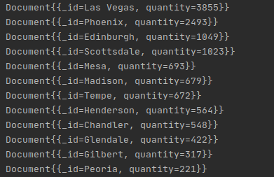
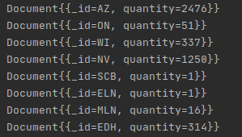
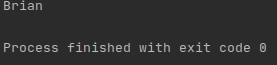
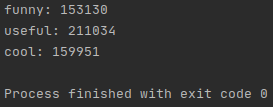

# Raport z ćwiczeń z MongoDB
Autor: Krzysztof Hardek
## Zad 4
> Za pomocą narzędzia Robo 3T wykonaj polecenie dodające do stworzonej bazy kolekcję „student”.


> Wyświetl wynik dodania danej w formie. json txt.



## Zad 5 
> Za pomocą narzędzia Robo 3T wykonaj zapytania, które pozwolą uzyskać następujące wyniki.
### a)
> ilość miejsc ocenianych na 5 gwiazdek.
```js
db.business.find({ stars: 5 }).count()
```

### b)
> ilość restauracji w każdym mieście, wynik posortuj malejąco napodstawie liczby.
```js
db.business.aggregate([
    {
     $match: { categories: "Restaurants" },
    },
    {
     $group: { 
      _id: "$city",
      quantity: { $sum: 1 }
     }
    },
    {
     $sort: {
      quantity: -1
     }
    }
])
```

### c)
> ilość hoteli w każdym stanie/okręgu, które posiadaja darmowe Wi-fi oraz ocenę co najmniej 4.5 gwiazdki.
```js
db.business.aggregate([
    {
        $match: { categories: "Hotels", "attributes.Wi-Fi": "free", stars: { $gte: 4.5 } }
    },
    {
        $group: {
            _id: "$state",
            quantity: { $sum: 1 }
        }
    }
])
```


## Zad 6
> Wykonaj zadania punktu 5 z poziomu języka Java
### a)
```java
public int getFiveStarPlaces(){
    MongoCollection<Document> collection = db.getCollection("business");
    var query = new BasicDBObject("stars", new BasicDBObject("$eq", 5));
    var docs = new ArrayList<Document>();
    collection.find(query).into(docs);
    return docs.size();
}
```

### b)
```java
public AggregateIterable<Document> getCityRestaurants(){
    Document match = new Document("$match", new Document("categories", "Restaurants"));

    Document groupFields = new Document("_id", "$city");
    groupFields.put("quantity", new Document("$sum", 1));
    Document group = new Document("$group", groupFields);

    Document sort = new Document("$sort", new Document("quantity", -1));

    MongoCollection<Document> collection = db.getCollection("business");

    List<Document> pipeline = Arrays.asList(match, group, sort);
    return collection.aggregate(pipeline);
	}
```

### c)
```java
public AggregateIterable<Document> getHotelAmount(){
    Document match = new Document("$match", new Document("categories", "Hotels"));
    match.put("$match", new Document("attributes.Wi-Fi", "free"));

    Document groupFields = new Document("_id", "$state");
    groupFields.put("quantity", new Document("$sum", 1));
    Document group = new Document("$group", groupFields);

    MongoCollection<Document> collection = db.getCollection("business");

    List<Document> pipeline = Arrays.asList(match, group);
    return collection.aggregate(pipeline);
}
```

## Zad 7
> Napisz kod w języku Java, który zwróci użytkownika (nazwa
użytkownika) o największej liczbie pozytywnych recenzji (ocena co
najmniej 4.5)
```java
String getBestUser(){
    MongoCollection<Document> collection = db.getCollection("user");
    var query = new Document("average_stars", new Document("$gt", 4.5));
    var docs = new ArrayList<Document>();
    collection.find(query).into(docs);
    Document bestUser = null;

    for(Document user: docs){
        if(bestUser == null || user.getInteger("review_count") > bestUser.getInteger("review_count")){
            bestUser = user;
        }
    }

    return (String) bestUser.get("name");
}
```

## Zad 8 
> Napisz kod w języku Java, który zwróć, ile recenzji posiadają oceny z
każdej kategorii: funny, cool, useful. Przypisanie recenzji do kategorii
oznacza, że przynajmniej jedna osoba zagłosowała na recenzje w tej
kategorii).
```java
ArrayList<Integer> getVotesCounts(){
    ArrayList<Integer> result = new ArrayList<>();

    MongoCollection<Document> collection = db.getCollection("user");
    int funny_count = 0;
    int useful_count = 0;
    int cool_count = 0;

    var docs = new ArrayList<Document>();
    FindIterable fit = collection.find(new Document("votes", new Document("$exists", true)));
    fit.into(docs);

    for(Document user: docs){
        Document votes = (Document) user.get("votes");
        if(votes.getInteger("funny") > 0) funny_count++;
        if(votes.getInteger("useful") > 0) useful_count++;
        if(votes.getInteger("cool") > 0) cool_count++;
    }
    result.add(funny_count);
    result.add(useful_count);
    result.add(cool_count);

    return result;
}
```


